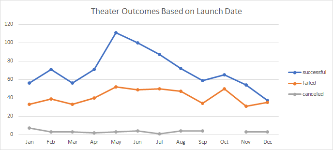
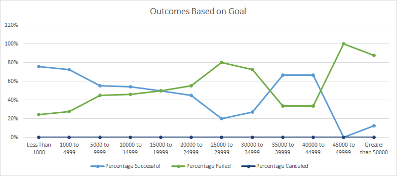

# kickstarter-analysis

## Overview of Project

### Purpose
The purpose of this project was to analyze Kickstarter data. Specifically, I wanted to look at Kickstarters categorized as related to theater, and compare the number of successful, failed, or canceled Kickstarters by the month they were started to determine if there was any correlation between the month started and the outcome. I also wanted to drill down into Kickstarters for plays, and view the various outcomes by how much money they were looking to raise, to determine if there was a correlation between financial goal and outcome.

## Analysis and Challenges
Analysis was done using data from over 4,000 Kickstarter campaigns. By filtering by category and subcategory, I was able to find data relevant to me and create pivots and tables to compare outcomes to time of year and to financial goal.

### Analysis of Outcomes Based on Launch Date
Created pivot table for the 'theater' category showing outcome of campaigns by month of year created. Created line chart.

### Analysis of Outcomes Based on Goals
Created a table to identify outcomes of campaigns in the 'play' subcategory, using 12 different ranges of goal dollar amounts. Used COUNTIFS formulas to populate table and then created line chart.

### Challenges and Difficulties Encountered
Two challenges encountered:
1 - Dates on the raw data were in Epoch/Unix, so had to be converted to a usable format
2 - I was new to the COUNTIFS formula, so it took some Googling and playing around with to get right

## Results

- What are two conclusions you can draw about the Outcomes based on Launch Date?
The data shows that more Kickstarter campaigns started in May and June were successful than the rest of the year, with more than two times as many successful than failed. Conversely, October through December were the worst months to start a campaign, with nearly half failing.

- What can you conclude about the Outcomes based on Goals?
The data shows that smaller campaigns, specifically those with a goal of less than $1,000 had the highest percentage of success at 76%. Campaigns seeking between $1,000 and $5,000 had a similar rate of 73%. For campaigns requiring more money, setting a goal between $35,000 and $45,000 led to a 67% success rate. However, campaigns seeking over $45,000 had failure rates of over 88%.

- What are some limitations of this dataset?
While the data shows correlation between times of year and financial targets, it does not provide insight into why that correlation exists.

- What are some other possible tables and/or graphs that we could create?
I would like to see how the title and descriptions of the campaigns correlate to the outcome. Do longer titles or descriptions do better? Is there a point where going over a certain length correlates with failure? We could also drill down to the country level, and see if these trends are the same or if there are country specific differences.
